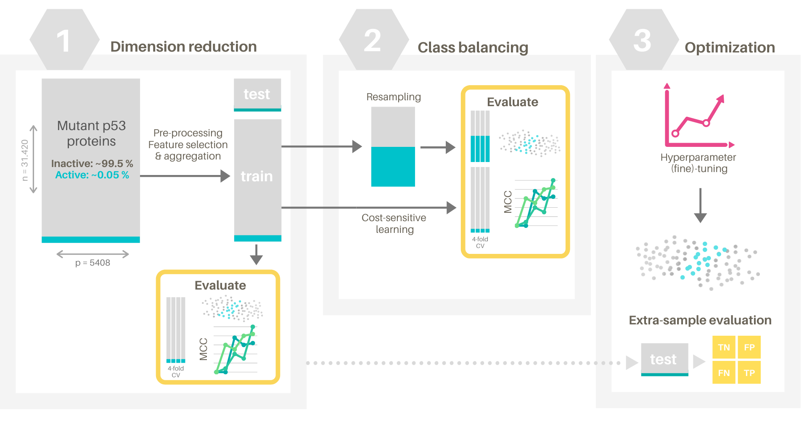
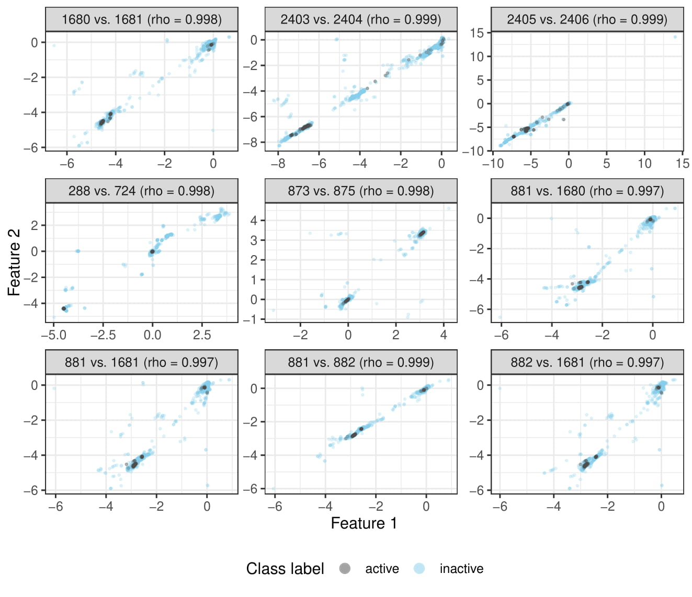
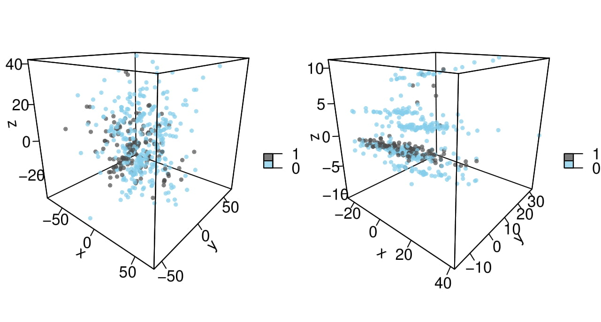

# Predicting the tumor suppression activity of p53 mutant proteins

The [p53 mutants dataset](https://archive.ics.uci.edu/ml/datasets/p53+Mutants) consists of 31420 mutant p53 proteins with a total of 5408 numeric features, as well as their experimentally determined tumor suppression activities. The goal of this project was to predict the activity of a protein given these numeric features. The primary challenges specific to this dataset were the dimensionality of the feature space as well as the class imbalance: the "active" class contained only 151 instances (~ 0.5 %). Three different classifiers were used: a logistic regression (LR) model, a random forest (RF) classifier and a neural network (NN).

Optimization of the LR and RF pipelines was performed in 3 consecutive steps (Fig 1).

*Figure 2. Schematic overview of the workflow to optimize a prediction model for p53 mutant protein activity classification. Details are given below.*

First, preprocessing and dimension-reduction was performed. Then, the dimension-reduced dataset was used to evaluate how (direct and indirect) class-balancing strategies affected performance. Lastly, the classifier itself was optimized in terms of its hyperparameters and the extra-sample performance was estimated using the held-out test set (obtained from a stratified 80/20 split). Optimization of each step was done in terms of the downstream classification performance (4-fold CV on the training set). To facilitate efficient iteration over different algorithms and hyperparameters, the Matthews Correlation Coefficient (MCC)) was used. Furthermore, for the initial optimization steps, the majority class was randomly downsampled and the downstream classifier was jointly optimized for performance but as well as efficiency.

# Data cleaning and exploration

A total of 261 cases (all beloning to the majority class) lacked data for at least ~90% of the features and were removed. The presence of strong bivariate (linear) correlations between some feature pairs (Fig 2) further supported the hypothesis that final classification performance might benefit from feature selection or aggregation steps. 

  
*Figure 2. Exploratory visualizations indicate strong bivariate linear correlations between some feature pairs. The majority class (blue) was downsampled to improve clarity.*

To explore the class separability in the (transformed) feature space, we created different visualisations based on principal components analysis (PCA) (Fig 3, left), linear discriminant analysis (LDA) and t-stochastic neighbor embedding (t-SNE). Even though, unsurprisingly, class separation was not obvious in the low-dimensional mappings of the dataset, 2- or 3D mappings of a specific subset (i.e. the 3D distance features) (Fig 3, right) and supervised dimension reduction with LDA did provide indications that the features encoded information that allowed to (at least partly) seperate class labels.

  
*Figure 3. The first three principal components (PCs) of the entire data matrix explain only 20 % of total variance and provide no clear indications of (linear) class separability in the dimension-reduced space (left). The first 3 PCs of a subset containing features 4827-5408 (3D distance measures with clearly different univariate distributions) explain 41 % of total variance in the non-dimension-reduced feature subset and demonstrate slightly more pronounced clustering of the classess in the dimension-reduced space (right). The majority class (blue) was downsampled to improve clarity.*  

# Dimension reduction

Studies have reported that combining different feature selection methods that rely on different statistical assumptions (if any) can improve results of classification algorithms [@mares2016; @pohjalainen2015]. Hence, different univariate parametric and non-parametric selection criteria (F-score & Mutual Information Criterion [@baldi2000]) as well as model-based feature selection methods were evaluated. The added value of supplementing the reduced feature space with principal components (PCs) of the original dataset was evaluated as well. For the LR pipeline, this approach showed to improve downstream classification performance as compared to baseline when the variables were centered and scaled to unit variance prior to selecting a subset of ~500-1000 features based on a linear Support Vector Classifier (SVC) (fig S4), supplemented with a low number of PCs (Fig S5). Further finetuning resulted in a pipeline that outputted a 1024-dimensional data matrix, consisting of both original features (selected by model-based and univariate criteria) and PCs. Additional dimension-reduction through hierarchical or K-Means clustering was evaluated as well but found to reduce downstream performance. While the approach for the RF classifier was methodologically similar, optimal performance in terms of validation fold MCC was achieved with a much more stringent feature selection procedure, resulting in a subset of 145 features. This also included the *ad hoc* removal of "redundant" features based on their correlation with other features (the optimal exclusion threshold of 250 features was determined by 4-fold CV with a custom transformer class (`RemoveCorrelatedFeatures`)).

The aforementioned procedures relied strongly on manual supervision to find low-dimensional representations that maximized downstream classification performance. For the thirth classifier, manual optimization of the preprocessing steps was limited to variable scaling and clipping. By using a single hidden layer NN classifier with a limited number of hidden units (256), the model was implicetely forced to learn a (non-linear) 256-dimensional representation of the data matrix that maximized performance of the prediction task.

# Class balancing

Based on the preprocessed and dimension-reduced dataset, we further tested the added value of slight upsampling of the "active" (minority) class using random upsampling, but also through artificially constructing new instances using Synthetic Minority OverSampling (SMOTE), [@chawla2002], Adaptive synthetic sampling (ADASYN) [@haibohe2008] and SVM-based SMOTE (SVMSMOTE) [@nguyen2011]. The SVMSMOTE algorithm was found to perform best for this dataset, with optimal resampled class ratios being 0.01 (RF pipeline, Fig S6), 0.1 (LR pipeline) and 0.2 (NN classifier). Further class balancing through downsampling of the majority class was found to reduce performance. In addition, we also evaluated how cost-sensitive learning (CSL) (i.e. tuning the relative cost of misclassifying minority class instances during training) affected classification performance.

# Optimization

Lastly, all pipelines were optimized in terms of the hyperparameters of the classifier, including the class weight parameter for CSL (cf supra). This resulted in a regularizated LR model (Ridge penalty term, $\lambda$ = 1), a random forest with 500 trees with a maximum depth of 15 and a NN consisting of a single hidden layer (256 units) with a ReLu nonlinearity, a dropout layer (p=0.5) and a single unit output layer with a sigmoid activation function to produce probability outputs. Training of the NN involved mini-batch gradient descent (Adam optimizer with $\alpha=0.001$) with batches of 4096 instances to ensure that each mini-batch contained "active" instances. The bias was initialized at $log(N_a/N_i)$^[[https://www.tensorflow.org/tutorials/structured_data/imbalanced_data](https://www.tensorflow.org/tutorials/structured_data/imbalanced_data)] with $N_a$ and $N_i$ the number of instances from the active and inactive class, respectively.

# Results

For each classifier, 4 different pipelines (with and without resampling and/or CSL) were refitted on the entire training set (model-specific hyperparameters were the same for the different pipelines) and extra-sample performance was estimated using the held-out test set. To illustrate the added value of the optimization procedures, all classifiers were also fitted on the raw dataset. An overview of the results given in Fig 1 and Table 1. For the LR models (Fig 1A-B), preprocessing and dimension-reduction clearly improved performance for all 4 different class-balancing strategies (Fig 1A). This was different for the RFC: while optimization of the preprocessing pipeline improved the validation-fold MCC from ~0.5 to ~0.6 (data not shown), this was not reflected in the estimated performance (Fig 1C), suggesting that the optimization procedure resulted in overfitting of the training set. The NN outperformed the other models (Fig 1E-F), with the pipelines based on resampling correctly classifying 22/30 active proteins in the test set at a relatively low false positive rate (Fig 1F). Lastly, a soft-voting ensemble model was constructed from the 3 classifiers (no resampling, CSL (Table 1, 4th row)), this improved performance further as compared to the NN model: estimated precision was slightly lower (0.72 vs 0.73), but sensitivity increased from 0.73 to 0.77 and both the F1-score and the MCC increased from 0.73 to 0.74.

# Discussion

For this project, we developed a linear (LR) and 2 non-linear (RFC and NN) classifiers. The main challenges specific to this dataset were the dimensionality of the feature space and the class imbalance. These were addressed in a stepwise manner. Dimension-reduction was based on univariate, model-based and *ad hoc* feature redundancy (based on bivariate linear correlations) criteria. In addition, a non-linear low-dimensional representation of the feature space was obtained by directly optimizing w.r.t. the binary cross-entropy loss of the NN. Dimension reduction for the RFC resulted in a 145-dimensional subset (vs. 1024-dimensions for the LR). Even though the estimated performance of the former was relatively poor, this might be important when interpretability is important or when data acquisition is costly. All pipelines were optimized in terms of the MCC. While a single evaluation metric is intrinsically limited in terms of representing all different aspects of model performance, it does facilitate fast and efficient iteration over different preprocessing algorithms to guide the search towards a (local) optimum (in terms of the MCC) in algorithm space. When a practical application of the model specifically requires e.g. a high sensitivity or specificity, optimizing the pipeline in terms of this relevant metric might be preferred.

Both resampling with the SVMSMOTE algorithm and CSL were found to improve performance, but there was no obvious advantage of either resampling or CSL (or both). The optimal (resampled) class ratio's or class weights were found to be different between models, with the RF pipeline benefitting the least from SVMSMOTE upsampling. This might be partly caused by the fact that the stringent dimension-reduction step resulted in the removal of information that could have been relevant for the SVMSMOTE algorithm to generate artificial instances. Random downsampling was shown to consistently reduce downstream performance for all models, suggesting that the benefit of further reducing class imbalance didn't compensate for the associated information loss. Overall, estimated performance was highest for the NN classifier, and further improved by a soft-voting ensemble of all three classifiers. However, it should be noted that one should be cautious interpreting these points estimates of the extra-sample performance. Even though they are unbiased, the low number of "active" proteins in the test set might render them imprecise.

\pagebreak

# References

\pagebreak

\beginsupplement

# Supplementary material

## Overview of workflow and description of the attached files

All optimization and model training steps were performed in Jupyter notebooks using the cloud computational environments (4 CPU cores, 16 Gb RAM) provided by Kaggle^[https://www.kaggle.com/]. Relevant output was stored as csv-files and analyzed locally in R (source code attached as `p53_output.R` and `helper_functions.R`). Code that was repetitively used in different Kaggle notebooks (data loading, cleaning, splitting, custom transformer classess, etc.) is included in the `p53_helper_functions.py` file. Some of the notebooks were executed multiple times with different parameter grids. To avoid repetition, only a single version of the notebook was included, together with all output of the different runs as csv-files. A brief description about each notebook is given below.

### Exploratory Data Analysis (EDA)

`0__EDA`: EDA, cleaning and visualizations (PCA, LDA, tSNE) of the entire dataset (Fig S2, Fig S3).

### Logistic Regression and Random Forest Classifier

`1__LRC/RFC__DimRed_A`: Initial evaluation of different preprocessing pipelines, especially w.r.t. dimension-reduction (Fig S4, S5).
	
`1__LRC/RFC__DimRed_B`:	Finer grid search over the previously identified best-performing preprocessing pipelines.
	
`1__LRC__DimRed_C`: Evaluation of clustering algorithms on previously optimized pipelines.

`2__LRC/RFC__Resampling`:	Evaluation of different resampling algorithms: SMOTE, SVMSMOTE and ADASYN and random oversampling (minority class) and downsampling (majortiy class). Different class ratio's for the resampled dataset were tested, both through upsampling, downsampling or both (Fig S6).

`3__LRC/RFC__Classification`:	Hyperparameter tuning of the classifier's hyperparameters.

`4__LRC/RFC__Evaluation`:	Extra-sample performance estimation of the final models (Fig 1A-D).

### Neural network classifier

`1__NN__Opt`:	Optimization of preprocessing steps and NN architecture/hyperparameters.
	
`2__NN__CSL_no_resampling`:	Optimization of class_weight hyperparameter of the previously optimized model.
	
`2__NN__CSL_resampling`: Optimization of the class_weight hyperparameter of the previously optimized model, including upsampling algorithms.

`3__NN__Evaluation`: Estimation of the performance of the optimized models, visualizations of learning curves (Fig 1E-F).

### Ensemble model

`Ensemble_model`: Soft-voting classifier based on the LR, RFC and NN classifiers (CSL, no resampling)

\pagebreak

## Supplementary figures

![Overview of the effects of different preprocessing and feature-selection steps on the classication performance of a standard logistic regression (LR) classifier in terms of Matthews Correlation Coefficient (MCC). Already from the inclusion of 500-1000 features, the LR model fitted the training set perfectly, suggesting that the generalizability of the LR model might benefit from regularization strategies. Optimal validation fold performance appeared to be in the range 500-1000 features. Feature selection with a linear SVC and scaling with sklearn's StandardScaler class resulted in the best downstream performance. Baseline performance (i.e. without preprocessing (PP)) is indicated by the grey line. Lines and ribbons represent LOESS-smoothed averages with 95% confidence levels, respectively. \label{pp}](Results/1__DimRed/LRC/A/dimred.pdf)

![A finer grid search based on the results in Fig S3 showed the effects of the univariate criterium (F-score) threshold (k) and the linear SVC-based feature selection threshold (m) on the validation set MCC (variables were centered and scaled to unit variance). The different panels show the effect of supplementing no (left) up to 100 (right) principal components to the dimension-reduced dataset. Lines and ribbons represent LOESS-smoothed averages with 95% confidence levels, respectively. \label{pp}](Results/1__DimRed/LRC/A/lr_pp.pdf)

![Effects of different resampling-strategies on validation-fold MCC of a downstream RFC (with cost-sensitive learning). Different upsampling algorithms and class ratio's were evaluated, as well as the additional effect of random downsampling of the majority class by a factor 1 (i.e. no downsampling, left) to 2 (i.e. doubling the upsampling class ratio, right). The black line indicates baseline validation-fold MCC (i.e. no resampling). In contrast to the effects of resampling on the other pipelines (data not shown), the effects were limited, i.e. only minor upsampling (SVMSMOTE) to a class ratio of 0.01 was found to improve validation-fold MCC (left). Lines and ribbons represent LOESS-smoothed averages with 95% confidence levels, respectively. \label{pp}](Results/2__Resampling/RFC/rfc_resampling.pdf)